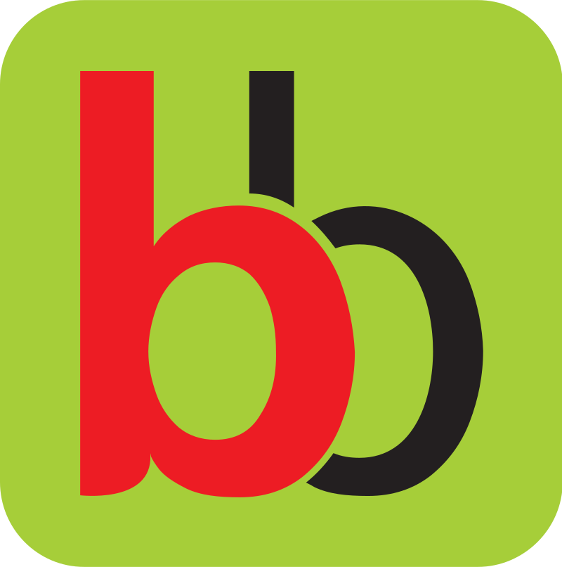

# BigBasket Clone

A pixel-accurate, responsive front-end clone of [BigBasket](https://www.bigbasket.com) — India's leading online grocery delivery platform. Built from scratch using React and Tailwind CSS as part of my Module 12 project at [WsCube Tech](https://www.wscubetech.com).

> **Project Status:** Work in progress. Core layout and homepage components are functional. More sections, pages, and features are actively being built.

## Preview

### Desktop



## Tech Stack

| Layer      | Technology                |
| ---------- | ------------------------- |
| UI Library | React 19                  |
| Routing    | React Router 7            |
| Styling    | Tailwind CSS 4            |
| Icons      | Lucide React, React Icons |
| Build Tool | Vite 8                    |
| Language   | JavaScript (ES6+)         |

## Project Structure

```
src/
├── main.jsx                        # App entry — BrowserRouter setup
├── css/styles.css                  # Tailwind import
├── pages/
│   └── Homepage.jsx                # Homepage view
├── components/
│   ├── common/
│   │   ├── CommonLayout.jsx        # Shared layout (Header + Outlet + Footer)
│   │   ├── Header.jsx              # Responsive header — desktop & mobile
│   │   └── Footer.jsx              # Footer (in progress)
│   └── RowOneHomePage.jsx          # Category button row on homepage
└── assets/images/                  # Logos and static images
```

## Features Built So Far

- **Responsive header** with two distinct layouts — a full navigation bar for desktop and a compact version with a hamburger drawer for mobile
- **Mobile drawer navigation** with smooth open/close toggling
- **Search bar** with focus-aware border styling
- **Category navigation row** with dynamic button rendering using reusable components
- **Centered max-width layout** using CSS Grid (`1fr / 1135px / 1fr` pattern) to match BigBasket's content width
- **Shop by Category**, quick delivery badge, login button, and cart icon

## What I Learned Building This

- Translating a production e-commerce UI into clean, component-based React code
- Building truly responsive layouts — not just scaling, but fundamentally different UI for mobile vs desktop
- Using Tailwind CSS 4 with the Vite plugin (no config file needed)
- Managing UI state with `useState` for interactive elements like the mobile drawer
- Structuring a React project with layout components and `<Outlet />` for nested routing
- Dynamic styling with a mix of Tailwind classes and inline styles when props-driven values are needed

## Getting Started

```bash
# Clone the repository
git clone https://github.com/siddharth-stn/big-basket-clone.git

# Navigate into the project
cd big-basket-clone

# Install dependencies
npm install

# Start the dev server
npm run dev
```

The app will be running at `http://localhost:5173`.

## Roadmap

- [ ] Complete homepage sections (banners, product carousels, offers grid)
- [ ] Build out the footer
- [ ] Add product listing and detail pages
- [ ] Implement category navigation
- [ ] Add more routes and pages

## About Me

I'm **Siddharth Pande** — a student at [WsCube Tech](https://www.wscubetech.com), currently pursuing the MERN Full Stack with AI course. This project is part of my **Module 12** coursework, where the focus is on building real-world front-end applications with React.

I've been writing code and shipping projects since 2022 — starting with HTML/CSS exercises and vanilla JavaScript, moving through Node.js backends with authentication and JWT, experimenting with Svelte, and now building production-grade React applications. With 70+ repositories on GitHub and a Pull Shark badge to show for it, I believe in learning by building, not just reading.

Through the WsCube Tech course alone, I've built clones of Myntra, Zomato, Netflix, Blinkit, 99Acres, and now BigBasket — each one more complex than the last. Beyond clones, I've worked on inventory systems, authentication flows, REST APIs, blog backends, and a teacher activity logging app. Every project has sharpened how I think about component architecture, responsive design, and writing clean, maintainable code.

- GitHub: [@siddharth-stn](https://github.com/siddharth-stn)
- LinkedIn: [Siddharth Pande](https://www.linkedin.com/in/siddharth-pande-b55307203/)

## Acknowledgements

Grateful to the instructors at **WsCube Tech** for their hands-on, project-driven teaching approach. The emphasis on building real-world clones rather than toy examples has made a tangible difference in how I approach front-end development. Their mentorship, structured curriculum, and focus on writing production-quality code from day one has shaped the way I think about building for the web.

---

_Built as a learning project at [WsCube Tech](https://www.wscubetech.com) — India's leading vernacular EdTech platform._
